# [fit] Si odio 
### *hablar en público*
## [fit] **¿Por qué lo sigo haciendo?**

^ LENTO

^ Último día después de almuerzo

---
# [fit] Francisco Díaz

### _**franciscodiaz.cl**_
### @fco_diaz

^ Soy Francisco Díaz
^ Tengo 31 años
^ Soy desarrollador de software hace 7 años

---

# 2010 - 2014

^ LENTO

^ Nunca di una charla, ni escribí un blog post

---

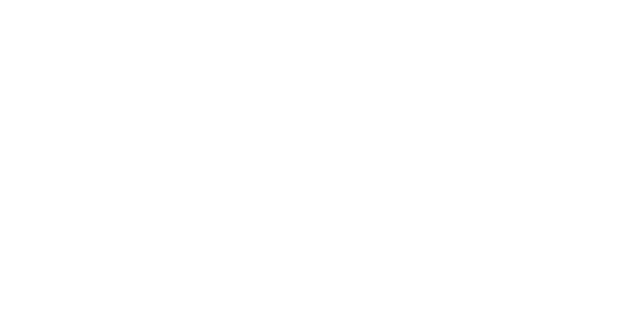

^ 2015 - 2017 organizador de un meetup

^ Host

^ Comenzar a hacer charlas

^ Comunidad

---

^ LENTO

^ Trabajo como desarrollador iOS
^ En Airbnb en SF

^ Hace un par de años -> Charlas

---

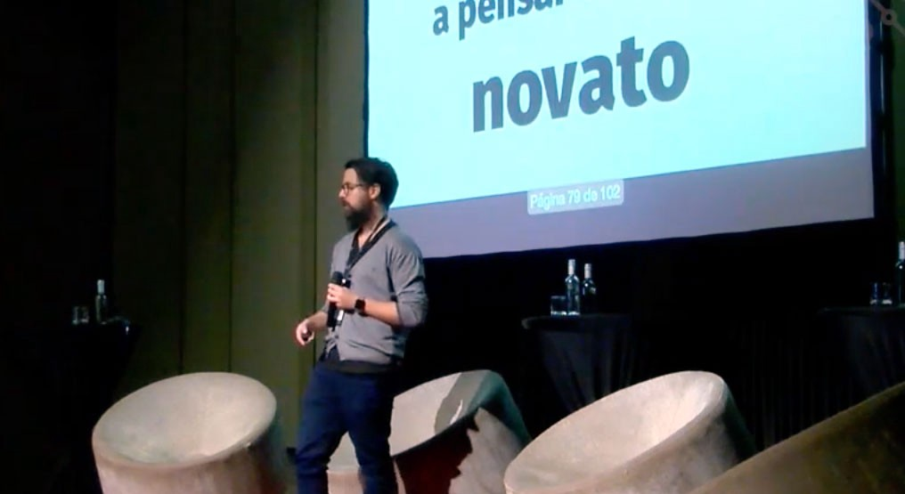

^ El año pasado di una charla en 9punto5 sobre cultura de trabajo remoto.
^ En Valdivia, ciudad natal

^ 300 personas

---

# [fit] ¿Por qué 
# [fit] _das charlas?_

^ LENTO

^ Alguien me preguntó

---

# "Dar 
## de vuelta a la 
# comunidad"

---

# "Compartir 
## mi conocimiento"

---

^ Y esta pregunta es aún más dificil para mi
^ Sé que hay personas que son natuarlmente fantásticas hablando en público
^ Pero mi proceso es un poco así:

---

# 1 mes antes:

^ LENTO

^ Normalmente un mes antes 

---

# 1 semana antes:

^ ¿Por qué postulé?

---

# ayer:

^ Correr por tu vida

---

# 9_punto_5

^ Antes de mi charla en 9punto5 en Valdivia
^ Estaba caminando de un lado para otro
^ Ensayando mi charla
^ Alguien del equipo organizador se me acercó en la noche
^ "Se notaba que estabas preparado"

---

^ LENTO

^ Ataque al corazón

---

# Sufro de 
# [fit] _ataques de pánico_

^ Y no me refiero a que me siento mal
^ Me refiero a que clínicamente tengo ataques de pánico
^ Lo que hace que me sienta particularmente incómodo en lugares que:

---

# Mucha gente

^ LENTO

---

# Espacios 
# [fit] cerrados

---

# Estrés

---

# Bajo presión

^ LENTO

---
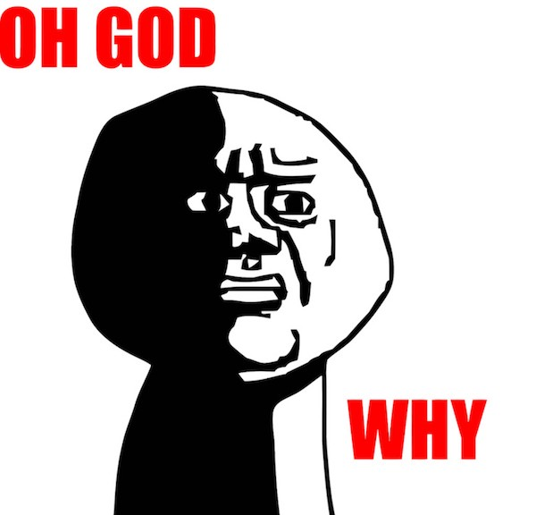

# [fit] _¿Conferencias?_

^ ¿Por qué doy charlas si es tan agotador?

^ Hay un personaje de la mitología griega.

---

# [fit] Sísifo

^ Tras morir escapó del infierno y vivió varios años en Corinto, donde había sido rey en vida, hasta que fue recapturado y, por su desobediencia, castigado a subir una roca por una montaña por la eternidad.

^ Sísifo debía empujar una roca hasta la cima de una colina, pero cada vez que esta llegaba ahí, volvía a caer y debía comenzar de nuevo.

---

# [fit] _Comenzar_
### es siempre 
# _dificil_

^ La parte más dificil de todo siempre es comenzar

^ Una vez que comienzas, la inercia te mantiene avanzando.

---

# Y uno lo 
# [fit] _olvida_

^ Cuando estás en el medio del proceso o hablando uno olvida lo dificil que fue comenzar.

^ No mucha gente habla de esto.

^ Pareciera que para todos acá es un proceso facil.

^ Mi idea es exponerme y dar a entender que no para todos es facil.

---

#  Y parece
# _cómodo_

^ Pareciera que el proceso fue cómodo.

---

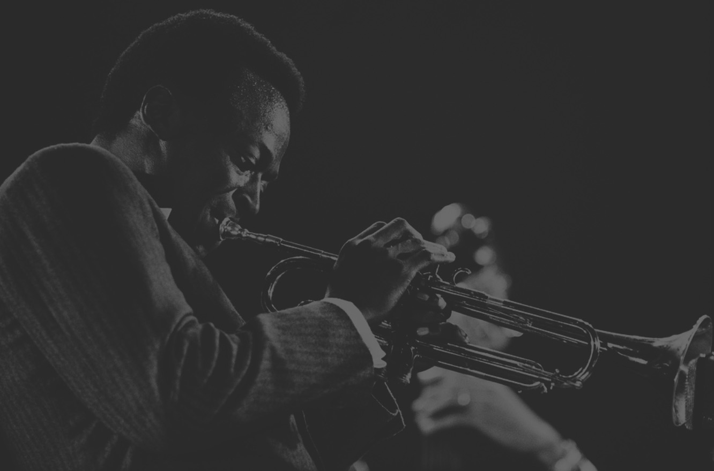

> Nunca deberías estar cómodo. El estar cómodo ha arruinado a muchos músicos.
-- Miles Davis

^ Pero estar nervioso y sentirse incómodo es parte del proceso
^ Y es parte de crecer.

---

# Nadie _creció_
### manteniéndose en su 
## _zona de confort_

^ LENTO

^ Sentirse un poco incómodo para:

^ Crecer como ingenieros

^ Crecer como personas

---

# [fit] ¿Por qué 
# [fit] _doy charlas?_

---

## ~~A pesar de que~~
## _Porque son_
# incómodas

---

---

# ¿Y después?

^ LENTO

---

^ ¿Por qué me siento feliz?

---

# **_Aprendí_** algo

^ Porque...
^ Sobre lo que estoy hablando
^ Sobre mi mismo

^ O aprendí de alguien más

---

# **_Interactué_** con gente

^ Soy introvertido

^ Esquina de la conferencia

^ Gente interesante

---

^ Las conferencias NO SON

---

# [fit] _NO SON_
### sobre charlas

^ LENTO

---

## son sobre
# [fit] _la gente_

---

# [fit] ¿Por qué _no_
# [fit] daba charlas?

^ 2010 - 2014

---

# [fit]_**"Mi trabajo es**_
# [fit]_**escribir software"**_

^ LENTO

^ Como ingeniero mi trabajo es comunicarme

---

# [fit] Mi trabajo es 
# _comunicar_

^ Si logro comunicarme mejor, estoy haciendo un mejor trabajo

^ Colegas, codigo

---

# _mejora_
## tu forma de comunicarte

^ Y hablar en público te fuerza a mejorar...

^ Mantener una idea coherente

^ Mantener al público escuchándote

---

## Colegas
# [fit]Requerimientos → Producto
## Código

^ Te pones en el lugar de la otra persona

---

# _**"No tengo**_
## _**nada preparado"**_

^ LENTO

^ De qué hablar?

---

^ Les tengo un secreto
^ Mi postulación a StarsConf fue de 3 párrafos

---

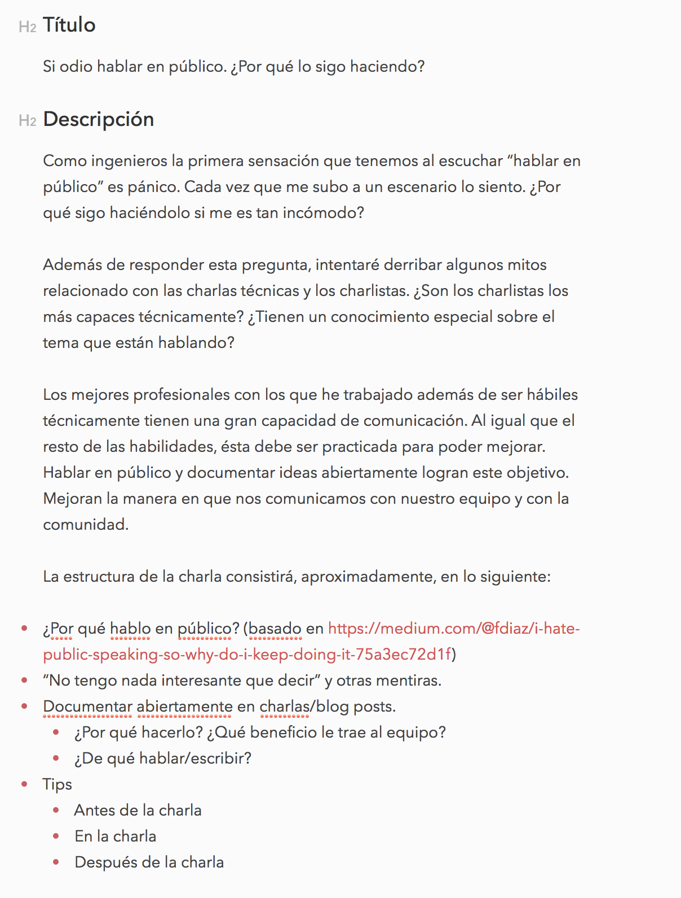

---

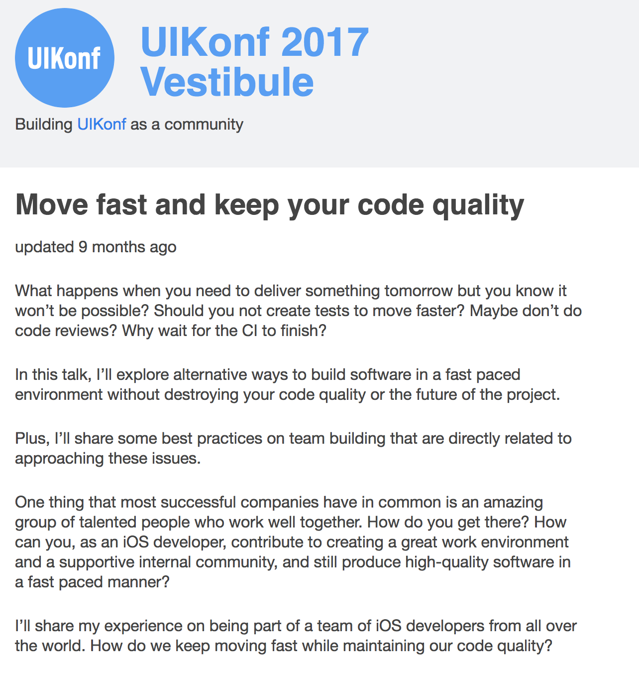

^ Y antes de StarsConf hablé en UIKonf en Berlin

^ Y fue de unos 3 párrafos

^ Tendencia

---

# _**"No se de qué hablar"**_

^ LENTO

^ Todos podemos hablar de algo

---

### Enseña 
# [fit] _cuando aprendas_

^ todo el tiempo aprendemos.

^ Estás pasando por los mismo retos que alguien aprendiendo

^ Porque como dijo Una ayer.

---

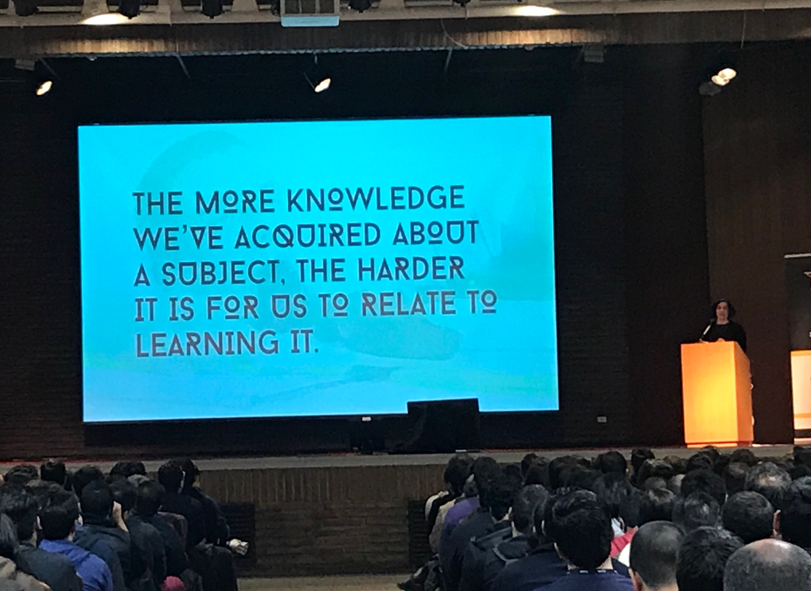

^ Una

^ Cuando aprendes estas en un momento privilegiado para enseñar.

^ Porque te puedes relacionar con la lucha.

---

# [fit]¿Qué quieres aprender?

^ Postula a una charla con algo que quieres aprender

^ Y no necesitas ser un experto

---

# _**"No soy un experto"**_

^ Tenemos miedo a quedar como novatos

^ Pero si soy sincero...

---

^ Nunca he hablado sobre algo que sienta que domine completamente.

^ No soy un experto en hablar en público.

^ Muchas veces siento que no estoy diciendo nada interesante.

^ Pero al final siempre hay alguien a quien le ayuda.

^ Y ha pasado por los mismos problemas que yo.

---

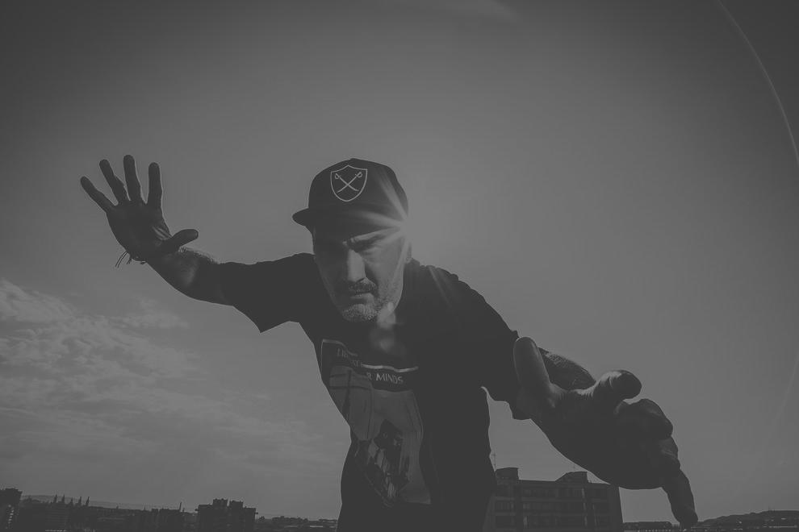

> Yo tampoco sé vivir, estoy improvisando.
-- Kase O

^ LENTO

^ Al final del día, todos estamos improvisando un poco.

^ En vez de esconderlo, mostrarlo.

---

## Muestra tu
# [fit] _proceso_

^ Tus errores sean los mismos que los de otra gente.

^ Tus dudas probablemente sean las mismas.

---

# _Equivocarse_
## es parte de aprender

^ LENTO

^ No tengas miedo a mostrar errores y a equivocarte en público.

^ Equivocarte en público finalmente

---

### Te obliga a 
# _controlar_ 
### tu propio 
# [fit] _ego_

^ Lo que, a la vez, te hace también un mejor ingeniero.

---

# _**"No tengo tiempo"**_

^ LENTO

---

# [fit] _Aprender_ es 
## parte del _trabajo_

^ La tecnología cambia constantemente

^ Hay que mantenerse al día

^ Quizás más que en cualquier otro rubro.

^ Si enseñas después de aprender, es solo parte del proceso

---

# [fit] _Comunicar_ es 
## parte del _trabajo_

^ LENTO

^ Y como ya dije...

^ Mejorar tu forma de comunicar, te mejora como profesional

---

# _**"No sé como exponer"**_

^ Nunca vas a aprender si no empiezas

^ Solo puedo entregarles mi proceso

---

# _Paso 1:_
## Investigar

---

# _Paso 2:_
## Draft / Slides

---

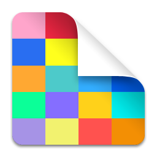 

# Deckset / MacDown

---

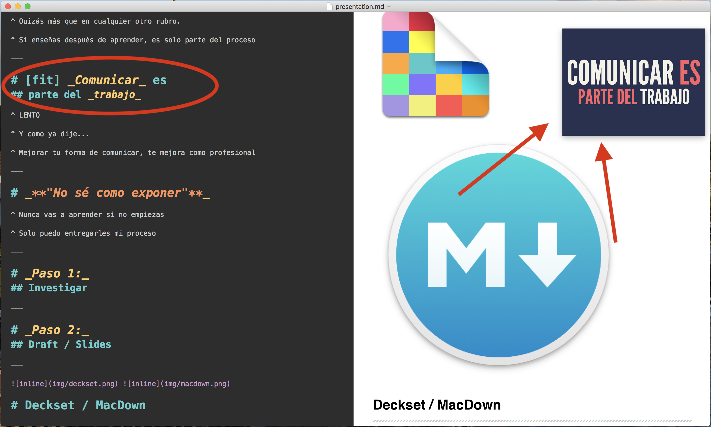

---

# _Paso 3:_
## Ensayar

---

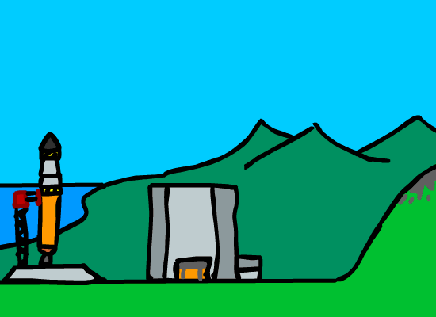

^ LENTO

^ Investigar, Slides, Ensayar

---

# [fit] Dato 
# [fit] sorprendente
## 😲

---

## [fit] A ⬆️ práctica
### ⬇️ estrés
## ⬆️ rendimiento

^ Mientras más practicas, mejor te vuelves.

---

## _parece infinito_

^ Y parece un ciclo infinito

---

# _Subiendo_
### la montaña

^ Porque al igual que Sísifo subiendo la montaña
^ Es un proceso constante.
^ Y siempre uno siente que está empezando de nuevo.

---

### Hasta que en 
# [fit] _algún momento_

---

^ Se acaba y venciste un poco tus miedos.

---

## Escribe
## Enseña
## Organiza
## Participa

^ Escribe un blog post

^ Enseña un taller

^ Organiza un meetup

^ Participa en uno

^ Que aprendiste ayer/hoy

^ Que te gustó (o no) de StarsConf

^ Lo que te apasiona

^ Al principio da miedo.

^ Pero como dijo un escritor francés años atrás

---

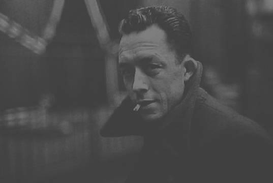
> La lucha por llegar a las cumbres basta para llenar el corazón de un hombre...
 
^ Y es porque al final de derrotar nuestros demonios internos, algo de alegría siempre queda, aún cuando sea breve.

---

> ...Hay que imaginarse a Sísifo feliz.
-- Albert Camus

^ Y yo creo que es cierto, solo la lucha por combatir nuestros propios temores vale la pena.

^ Al final del día, creo que terminamos con una sonrisa.

---

# [fit] Gracias
### _**franciscodiaz.cl**_
### @fco_diaz